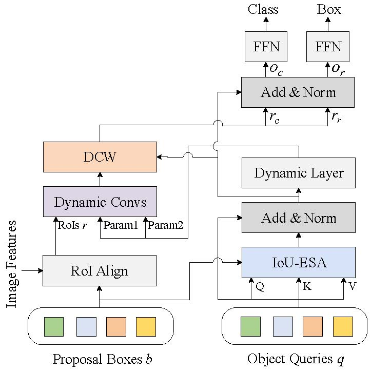

# IoU-Enhanced-Attention
## IoU-Enhanced Attention for End-to-End Task Specific Object Detection

[](https://opensource.org/licenses/MIT)



## Paper
[IoU-Enhanced Attention for End-to-End Task Specific Object Detection](https://arxiv.org/abs/2209.10391)


## Models
Method | box AP | download
--- |:---:|:---:
[R50_100pro_3x](projects/SparseRCNN/configs/sparsercnn.res50.100pro.3x.yaml) | 44.4 | [model](https://pan.baidu.com/s/1r62IloDxkfTDox8XeCW8Eg) 
[R50_300pro_3x](projects/SparseRCNN/configs/sparsercnn.res50.300pro.3x.yaml) | 46.4 | [model](https://pan.baidu.com/s/1r62IloDxkfTDox8XeCW8Eg)
[R101_100pro_3x](projects/SparseRCNN/configs/sparsercnn.res101.100pro.3x.yaml) | 45.6 | [model](https://pan.baidu.com/s/1r62IloDxkfTDox8XeCW8Eg)
[R101_300pro_3x](projects/SparseRCNN/configs/sparsercnn.res101.300pro.3x.yaml) | 47.5 | [model](https://pan.baidu.com/s/1r62IloDxkfTDox8XeCW8Eg)

Models are available in [Baidu Drive](https://pan.baidu.com/s/1r62IloDxkfTDox8XeCW8Eg) by code jysg.


## Installation
The codebases are built on top of [Detectron2](https://github.com/facebookresearch/detectron2) and [SparseR-CNN](https://github.com/PeizeSun/SparseR-CNN).

#### Requirements
- Linux or macOS with Python ≥ 3.6
- PyTorch ≥ 1.5 and [torchvision](https://github.com/pytorch/vision/) that matches the PyTorch installation.
  You can install them together at [pytorch.org](https://pytorch.org) to make sure of this
- OpenCV is optional and needed by demo and visualization

#### Steps
1. Install and build libs
```
git clone https://github.com/bravezzzzzz/IoU-Enhanced-Attention.git
cd IoU-Enhanced-Attention
python setup.py build develop
```

2. Link coco dataset path to IoU-Enhanced-Attention/datasets/coco
```
mkdir -p datasets/coco
ln -s /path_to_coco_dataset/annotations datasets/coco/annotations
ln -s /path_to_coco_dataset/train2017 datasets/coco/train2017
ln -s /path_to_coco_dataset/val2017 datasets/coco/val2017
```

3. Train
```
python projects/SparseRCNN/train_net.py --num-gpus 8 \
    --config-file projects/SparseRCNN/configs/sparsercnn.res50.100pro.3x.yaml
```

4. Evaluate
```
python projects/SparseRCNN/train_net.py --num-gpus 8 \
    --config-file projects/SparseRCNN/configs/sparsercnn.res50.100pro.3x.yaml \
    --eval-only MODEL.WEIGHTS path/to/model.pth
```

5. Visualize
```    
python demo/demo.py\
    --config-file projects/SparseRCNN/configs/sparsercnn.res50.100pro.3x.yaml \
    --input path/to/images --output path/to/save_images --confidence-threshold 0.4 \
    --opts MODEL.WEIGHTS path/to/model.pth
```


## Citing

If you use this code for your research, please cite

```BibTeX

@article{zhao2022iou,
  title={IoU-Enhanced Attention for End-to-End Task Specific Object Detection},
  author={Zhao, Jing and Wu, Shengjian and Sun, Li and Li, Qingli},
  journal={arXiv preprint arXiv:2209.10391},
  year={2022}
}

```
